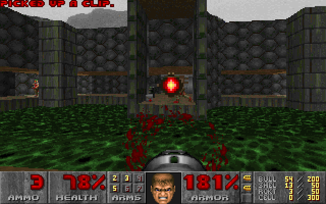

# Doom on the musql VDBE



Unmodified Doom (doomgeneric), compiled C -> LLVM IR -> musql VDBE bytecode
and run by `engine.ProgramStmt`: the same register machine every SQL statement
runs on. Each frame is a result row; key events are bound parameters. The idea
comes from Turso's
[turso-vdbe-doom-example](https://github.com/tursodatabase/turso-vdbe-doom-example);
`vdbecc/` is musql's own IR-to-bytecode compiler for it.

Turso ran it on their stock VDBE and report that with specialized memory
instructions it ran at over 60 fps
([blog post](https://turso.tech/blog/running-unmodified-doom-in-the-sqlite-bytecode-language)).

Neither Doom's IR nor the WAD is vendored here (Doom is GPL-2). On first run the
example fetches both from Turso's repository at a pinned commit (with go-git,
about 20 MB) and caches them in your user cache directory:

    go run ./cmd/doom     # a window (gogpu)
    go run ./cmd/doomhl   # headless: fps + last frame as PNG

`-ll` and `-wad` point at local copies instead.

Arrows move, Ctrl fires, Space uses, Shift runs, Alt or `,` `.` strafe, Enter/Esc
for the menu, 1-7 pick weapons.

`go test ./vdbecc/` compiles every program in `vdbecc/testdata/c` both natively
and to bytecode and compares the results (needs clang; skipped without it).

## Measured performance

Measured on an **Intel Core i9-12900HK**, Linux amd64,
Go 1.27.1. Each result is the median of three fresh-process runs per mode,
using the same binary and assets at 320×200.

| Workload | Without JIT | With JIT | Speedup |
| --- | ---: | ---: | ---: |
| 200 ticks | 37.7 fps | 95.6 fps | 2.54× |
| 1,000 ticks | 26.3 fps | 63.3 fps | 2.41× |

The 200-tick sequence produced 243 frames with frame-stream FNV-1a hash
`8b7d89da7a40683d`; the 1,000-tick sequence produced 1,043 frames with hash
`46cb13cc70d50745`. All six runs within each workload matched. The longer
sequence reaches different parts of the title/demo cycle.

The program contains 159,609 instructions and 40,561 registers.

## Measure JIT performance

Build the headless runner once, then run the same workload with JIT disabled
and enabled. From `examples/doom`:

```sh
go build -o /tmp/musql-doomhl ./cmd/doomhl

/tmp/musql-doomhl -jit=false -ticks 1000 -png /tmp/doom-vdbe.png

/tmp/musql-doomhl -jit=true -ticks 1000 -png /tmp/doom-jit.png
```

The runner reports elapsed time, fps, and a hash over every rendered frame.
Compare frame counts and hashes as well as speed. Timing covers the stepping
loop, including game initialization and frame hashing; it excludes LLVM IR
translation, JIT compilation, and PNG encoding. This is headless throughput at
320×200, without window rendering or keyboard input. The port advances a
synthetic game clock instead of sleeping.

Use `-ticks 200` in both commands to repeat the shorter workload.
Use the same tick count for comparisons: longer runs cover different parts of
the title/demo sequence and can have substantially different average fps.
